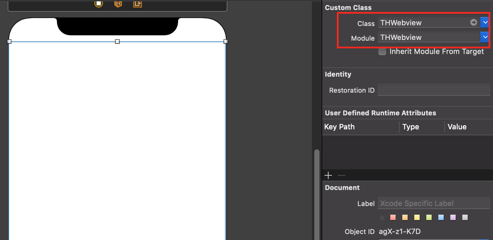
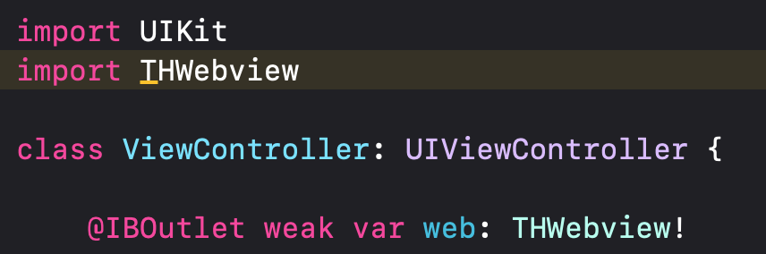

# THWebview
#### Super Easy WKWebView for simple web page.

# Feature
- [x] pure swift 5.0 code
- [x] class is custom UIView and overiding Webkit
- [x] you can load Webpage or Website 
- [x] require Swift 5.0 or later

# Installation

#### Swift Package Manager
Simply add THWebview to your `Package Dependancies`.

Add only url 'https://github.com/aboutyu/THWebview.git' into Package Dependancies

#### CocoaPods
Simply add THWebview to your `Podfile`.

```
pod 'THWebview'
```
Enter command instruction into your terminal.

```
pod install
```

# Usage

You must create UIView and it use custom class in the storyboard after install THWebview.



Then you must also import THWebview and create a IBOutlet.



The following sample code for your reference.

```swift
import UIKit
import THWebview

class ViewController: UIViewController {

    @IBOutlet weak var web: THWebview!
    
    override func viewDidLoad() {
        super.viewDidLoad()
        
        web.isIndicator = true
        web.isGestureForworkBack = true
        web.loadWeb(url: "https://m.youtube.com")

        //-MARK: write received delegate patterns
        web.action = { [weak self] (pattern) in
            guard let self = self else { return }
            
            print("action pattern:", pattern)
            switch pattern {
            case .started(let navigation): 
                print("action naviagtion:", navigation)
                break
            case .finished(let navigation): 
                print("action naviagtion:", navigation)
                break
            case .failed(let error): 
                print("action error:", error)
                break
            case .closed: 
                break
            }
        }
        
        //-MARK: write received decidePolicyFor delegate
        web.decisionHandler = { [weak self] (url, navigation) in
            guard let self = self else { return }
            print("decisionHandler url:", url)
            print("decisionHandler naviagtion:", navigation)
        }
    }
}
```

# License

THWebview is available under the MIT license. See the LICENSE file for more info.

